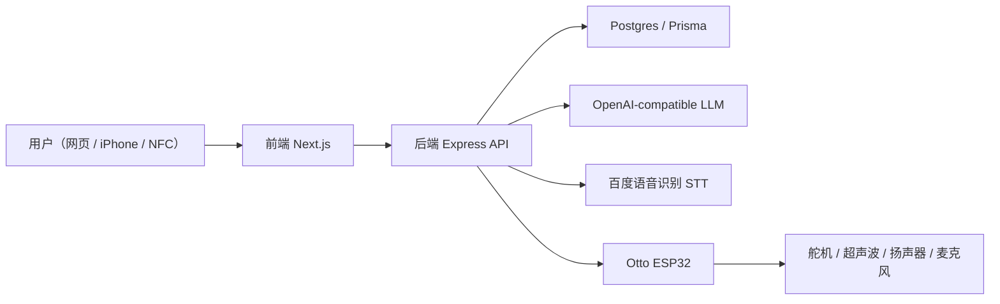
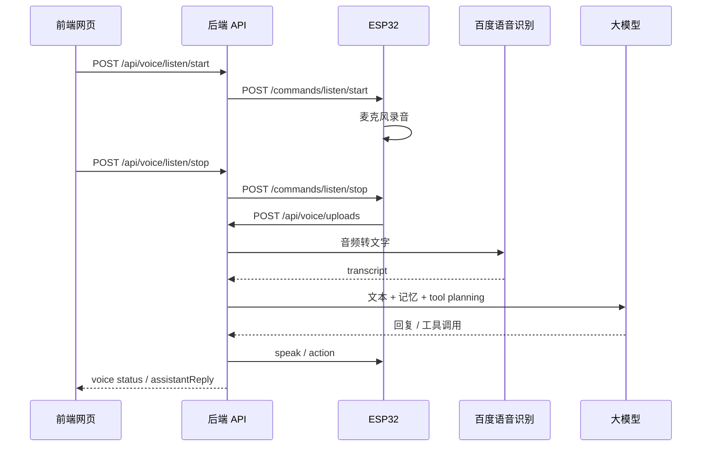

# Otto 项目总览文档

本文档用于从系统层面解释当前仓库的完整结构与工作方式，重点覆盖：

1. 系统架构
2. Otto 中 ESP32 的机电控制
3. LLM 链接方式，包括 tool calling、语音对话、长期记忆
4. 网页开发与网页对机器人的控制

---

## 1. 项目目标与目录结构

这个仓库不是单纯的 Otto 动作 demo，而是一个完整的“实体机器人 + 网页控制台 + 大模型对话 + 语音交互 + NFC 抽签”的系统。

当前目录分为两大部分：

- `Arduino/otto_actions_test/`
  - 烧录到 Otto 的 ESP32 固件
  - 负责舵机动作、超声波测距、I2S 扬声器播放、麦克风录音、HTTP 设备接口
- `otto_web/`
  - 网页前后端系统
  - 前端：`Next.js + Tailwind`
  - 后端：`Express + Prisma + Postgres`

关键入口文件：

- ESP32 固件主入口：
  [Arduino/otto_actions_test/otto_actions_test.ino](/Users/jimjimu/Desktop/实体结构与制造/otto_actions_test/Arduino/otto_actions_test/otto_actions_test.ino:1)
- Arduino 动作库：
  [Arduino/otto_actions_test/ottoactions.h](/Users/jimjimu/Desktop/实体结构与制造/otto_actions_test/Arduino/otto_actions_test/ottoactions.h:1)
- 后端入口：
  [otto_web/backend/src/app.ts](/Users/jimjimu/Desktop/实体结构与制造/otto_actions_test/otto_web/backend/src/app.ts:1)
- 前端 Control Center 页面：
  [otto_web/frontend/app/control-center/page.tsx](/Users/jimjimu/Desktop/实体结构与制造/otto_actions_test/otto_web/frontend/app/control-center/page.tsx:1)

---

## 2. 系统架构

当前系统的核心设计是：**前端不直接连 Otto，所有业务入口统一走后端，后端再去控制 ESP32**。

### 2.1 总体架构

### 2.2 当前四条主业务链路

1. **网页控制机器人**
   - 前端点击动作按钮
   - 后端调用 Otto 设备服务
   - ESP32 接收 HTTP 命令并执行

2. **网页文字对话**
   - 前端发文字到后端
   - 后端调用 LLM
   - LLM 可触发 tool calling
   - 后端决定是否让 Otto 动作 / 说话

3. **语音对话**
   - 网页点“开始聆听”
   - 后端通知 Otto 开始录音
   - ESP32 用麦克风采集音频并上传后端
   - 后端走百度 STT 转文字
   - 再进入 LLM + tool calling
   - 最后让 Otto 用扬声器和动作回应

4. **NFC 抽签**
   - 手机扫标签打开 `/fortune?tag=...`
   - 前端请求公开抽签接口
   - 后端返回对应签文，并触发 Otto 进入对应剧场

### 2.3 设备通信策略

当前采用的是 **局域网 HTTP**，不是 MQTT，也不是 WebSocket。

也就是说：

- 前端 -> 后端：HTTP / SSE
- 后端 -> Otto：HTTP
- Otto -> 后端：HTTP 上传语音

这种结构的优点是：

- 职责清晰
- 前端不用关心局域网设备细节
- 登录、数据库、LLM、长期记忆都放在后端
- ESP32 只做设备层

---

## 3. Otto 中 ESP32 的机电控制

ESP32 固件在这个项目里不是一个“简单的动作脚本”，而是一个小型设备系统。

### 3.1 硬件映射

#### 3.1.1 舵机

在 [ottoactions.h](/Users/jimjimu/Desktop/实体结构与制造/otto_actions_test/Arduino/otto_actions_test/ottoactions.h:7) 中定义了 6 路舵机：

- `GPIO13`：左胯
- `GPIO12`：右胯
- `GPIO14`：左脚
- `GPIO27`：右脚
- `GPIO26`：左臂
- `GPIO25`：右臂

内部统一用：

- `servos[6]`
- `currentPos[6]`

来维护当前姿态。

`currentPos` 很关键，因为整个动作系统不是每次都从固定角度硬切，而是依赖当前真实姿态平滑过渡。

#### 3.1.2 超声波雷达

在 [otto_actions_test.ino](/Users/jimjimu/Desktop/实体结构与制造/otto_actions_test/Arduino/otto_actions_test/otto_actions_test.ino:9) 中：

- `TRIG = GPIO32`
- `ECHO = GPIO33`

它负责“有人靠近”的距离检测。

当前逻辑不是直接进完整剧场，而是：

- Otto 空闲
- 没有网页命令正在执行
- 没有录音
- 距离进入指定阈值

时会做一次简短问候。

#### 3.1.3 扬声器 / I2S 功放

当前 Otto 通过 I2S 输出 TTS 音频：

- `AMP_LRC = GPIO22`
- `AMP_DIN = GPIO15`
- `AMP_BCLK = GPIO2`

ESP32 会从百度 TTS 或文本回复中拿到音频，再通过 I2S 输出到扬声器。

#### 3.1.4 麦克风

当前麦克风已经接入语音链路：

- `MIC_WS = GPIO21`
- `MIC_SD = GPIO35`
- `MIC_SCK = GPIO19`

ESP32 可以：

- 开始录音
- 结束录音
- 将短时音频上传给后端

---

### 3.2 机电控制设计

#### 3.2.1 动作库

动作库定义在 [ottoactions.h](/Users/jimjimu/Desktop/实体结构与制造/otto_actions_test/Arduino/otto_actions_test/ottoactions.h:1)。

它由三层组成：

1. **基础层**
   - `initOtto()`
   - `smoothMove()`
   - `goHomeSmooth()`
   - `playGesture()`

2. **Oscillator 振荡层**
   - 用于周期性动作
   - 比如挥手、欢呼、身体波动、手臂起伏

3. **动作函数层**
   - 例如 `actionWalk`
   - `actionWaveGoodbye`
   - `actionDoubleGreet`
   - `actionCheer`
   - `actionTwistHip`
   - `actionHeroPose`
   - 以及后续扩展动作

#### 3.2.2 动作执行方式

ESP32 并不是在 HTTP handler 里直接执行动作，而是：

1. HTTP 收到命令
2. 命令进入内部队列
3. 后台命令任务顺序消费
4. 再调用动作函数

这样做的意义是：

- 避免 HTTP 请求阻塞太久
- 避免多个动作同时抢舵机
- 让 `isBusy` 状态明确
- 让网页端能稳定查询状态

#### 3.2.3 空闲行为与雷达逻辑

目前 Otto 待机时会保留雷达测距能力，但规则是“**轻量问候，不直接进完整剧场**”。

也就是说：

- 有人靠近时，先做自动问候
- 问候语由 `speakAsync(...)` 播放
- 然后回到待机
- 不会因为雷达一直反复进剧场

完整剧场现在主要由：

- 网页 / 后端命令
- NFC 抽签
- 或其他显式控制

来触发。

---

### 3.3 ESP32 当前对外暴露的 HTTP 设备接口

ESP32 现在本身就是一个局域网设备服务，常见入口包括：

- `GET /health`
- `GET /status`
- `POST /commands/action`
- `POST /commands/move`
- `POST /commands/speak`
- `POST /commands/calibrate`
- `POST /commands/sequence`
- `POST /commands/theater`
- `POST /commands/listen/start`
- `POST /commands/listen/stop`

鉴权方式是：

- Header：`X-Otto-Token`

其中最重要的是 `/status`，它会回传 Otto 当前设备状态，例如：

- `isOnline`
- `isBusy`
- `currentAction`
- `distanceCm`
- `signalStrength`
- `firmwareVersion`
- `memoryPercent`
- `batteryPercent`
- `coreTempC`
- `isListening`
- `audioUploadState`

这使得网页和后端都能把 Otto 当作一个“状态化设备”来处理，而不是单次 fire-and-forget 动作盒子。

---

## 4. LLM 链接：tool calling、语音对话、长期记忆

这一部分主要在 `otto_web/backend/` 实现。

### 4.1 LLM 接入方式

后端使用的是 **OpenAI-compatible API**，核心配置在：

- [env.ts](/Users/jimjimu/Desktop/实体结构与制造/otto_actions_test/otto_web/backend/src/config/env.ts:1)
- [openai.service.ts](/Users/jimjimu/Desktop/实体结构与制造/otto_actions_test/otto_web/backend/src/services/openai.service.ts:1)

关键环境变量：

- `LLM_BASE_URL`
- `LLM_API_KEY`
- `LLM_MODEL`

后端不会把密钥暴露给前端，前端永远只请求自己的 API。

---

### 4.2 文本聊天链路

文本聊天的核心路由在：

- [chat.routes.ts](/Users/jimjimu/Desktop/实体结构与制造/otto_actions_test/otto_web/backend/src/routes/chat.routes.ts:1)

流程是：

1. 前端发送用户文本
2. 后端把用户消息写入 `Conversation` / `Message`
3. 后端加载该用户的长期记忆
4. 先执行一轮 tool planning
5. 如果模型要调用工具，先执行工具
6. 再让模型生成最终回复
7. 通过 SSE 把流式内容发给前端
8. 将 assistant 回复落库

这条链路的编排核心在：

- [chat-orchestrator.service.ts](/Users/jimjimu/Desktop/实体结构与制造/otto_actions_test/otto_web/backend/src/services/chat-orchestrator.service.ts:1)

---

### 4.3 Tool Calling

当前 Otto 支持的 tool calling 定义在：

- [otto-tools.service.ts](/Users/jimjimu/Desktop/实体结构与制造/otto_actions_test/otto_web/backend/src/services/otto-tools.service.ts:1)

当前主要工具包括：

- `otto_execute_action`
- `otto_move`
- `otto_speak`
- `otto_calibrate`

它的作用不是让模型直接操作底层硬件，而是：

1. 模型先输出结构化工具调用意图
2. 后端校验参数
3. 后端调用 Otto 设备服务
4. 工具结果再回到对话上下文
5. 模型再生成最终自然语言回复

这意味着 LLM 并不直接控制 GPIO，而是通过后端提供的安全动作层控制 Otto。

---

### 4.4 “默认短回复自动播报”

目前后端还实现了一条额外策略：

- 如果最终回复是短回复
- 并且模型本轮没有主动调用 `otto_speak`

那么后端会自动让 Otto 把这句短回复播出来。

这样做的效果是：

- 普通长段解释：只显示网页
- 短句回应：默认实体 Otto 也会说出来

这样用户体验更像是在“和实体机器人说话”，而不是只在网页看字。

---

### 4.5 语音对话链路

语音对话的核心路由在：

- [voice.routes.ts](/Users/jimjimu/Desktop/实体结构与制造/otto_actions_test/otto_web/backend/src/routes/voice.routes.ts:1)

语音链路流程如下：

当前用的是 **百度智能云 STT**，核心服务在：

- [baidu-speech.service.ts](/Users/jimjimu/Desktop/实体结构与制造/otto_actions_test/otto_web/backend/src/services/baidu-speech.service.ts:1)

状态机会记录在 `VoiceSession` 表中，状态包括：

- `recording`
- `uploaded`
- `transcribing`
- `responding`
- `completed`
- `failed`

这样做的好处是：

- 前端能看到语音链路的每个阶段
- 出错时可定位到是“录音 / 上传 / 转写 / 大模型 / 回复”哪一段失败

---

### 4.6 长期记忆

长期记忆相关逻辑主要在：

- [memory.service.ts](/Users/jimjimu/Desktop/实体结构与制造/otto_actions_test/otto_web/backend/src/services/memory.service.ts:1)
- [schema.prisma](/Users/jimjimu/Desktop/实体结构与制造/otto_actions_test/otto_web/backend/prisma/schema.prisma:1)

数据库表是：

- `UserMemory`

它的核心字段包括：

- `kind`
- `content`
- `summary`
- `salience`
- `source`
- `status`
- `lastUsedAt`

当前设计是：

1. 每次对话完成后
2. 后端尝试从用户输入和 assistant 回复中抽取长期记忆
3. 写入 `UserMemory`
4. 下次对话时检索并注入 memory context

这意味着 LLM 不是“每轮都失忆”的，而是会带着用户偏好继续回答。例如：

- 用户偏好更活泼的互动方式
- 用户偏好少说话、多动作
- 用户喜欢某些动作风格

这些长期记忆既会影响文本回答，也会影响 tool calling 的动作倾向。

---

## 5. 网页开发与网页对机器人的控制

### 5.1 前端技术栈

前端位于 `otto_web/frontend/`，使用：

- `Next.js`
- `TypeScript`
- `Tailwind CSS`

主要页面包括：

- `/login`
- `/control-center`
- `/settings`
- `/oracle`
- `/action-lab`
- `/fortune`

---

### 5.2 Control Center

Control Center 是网页控制 Otto 的主界面，入口在：

- [control-center/page.tsx](/Users/jimjimu/Desktop/实体结构与制造/otto_actions_test/otto_web/frontend/app/control-center/page.tsx:1)

这个页面主要负责：

- 查看 Otto 实时状态
- 快捷动作按钮
- 方向控制
- 语音控制（开始聆听 / 停止聆听）
- 显示 transcript 和 Otto reply

状态是通过：

- [use-robot-status.ts](/Users/jimjimu/Desktop/实体结构与制造/otto_actions_test/otto_web/frontend/hooks/use-robot-status.ts:1)
- [use-voice-session-status.ts](/Users/jimjimu/Desktop/实体结构与制造/otto_actions_test/otto_web/frontend/hooks/use-voice-session-status.ts:1)

轮询后端拿到的。

---

### 5.3 后端如何控制 Otto

前端不直接打 Otto 的 IP，而是统一调用后端 API，例如：

- `GET /api/robot/status`
- `GET /api/robot/actions`
- `POST /api/robot/actions/:actionKey/execute`
- `POST /api/robot/move`
- `POST /api/robot/speak`
- `POST /api/robot/calibrate`

这些都定义在：

- [robot.routes.ts](/Users/jimjimu/Desktop/实体结构与制造/otto_actions_test/otto_web/backend/src/routes/robot.routes.ts:1)

后端再通过 `OttoDeviceService` 去调用实际设备：

- [otto-device.ts](/Users/jimjimu/Desktop/实体结构与制造/otto_actions_test/otto_web/backend/src/services/otto-device.ts:1)

如果是 mock 模式，后端用：

- `MockOttoDeviceService`

如果是真机模式，后端用：

- `Esp32HttpOttoDeviceService`

这样做的价值是：

- 前端完全不需要关心真实设备 IP、token、队列、动作校验
- 设备协议以后变成 MQTT / WebSocket，也不用重写前端

---

### 5.4 Action Lab

Action Lab 是动作编排页，入口在：

- [action-lab/page.tsx](/Users/jimjimu/Desktop/实体结构与制造/otto_actions_test/otto_web/frontend/app/action-lab/page.tsx:1)

它的作用是：

- 从后端读取可用动作库
- 通过动作卡片拖出或点击加入序列
- 在线组织动作线程
- 保存 Sequence
- 执行 Sequence

相关后端路由：

- [action-lab.routes.ts](/Users/jimjimu/Desktop/实体结构与制造/otto_actions_test/otto_web/backend/src/routes/action-lab.routes.ts:1)

数据库里对应的是：

- `Sequence`
- `SequenceStep`

当前执行策略是：

1. 前端构建动作序列
2. 后端读出并展开 `steps`
3. 后端发给 Otto 的 `/commands/sequence`
4. ESP32 顺序执行

---

### 5.5 Oracle 与 NFC 抽签

#### Oracle 页面

Oracle 页负责：

- LLM 抽签式回答
- 历史签文
- 聊天式解释

#### NFC 抽签页

NFC 抽签页在：

- [fortune/page.tsx](/Users/jimjimu/Desktop/实体结构与制造/otto_actions_test/otto_web/frontend/app/fortune/page.tsx:1)
- [fortune/fortune-client.tsx](/Users/jimjimu/Desktop/实体结构与制造/otto_actions_test/otto_web/frontend/app/fortune/fortune-client.tsx:1)

对应后端接口：

- [nfc.routes.ts](/Users/jimjimu/Desktop/实体结构与制造/otto_actions_test/otto_web/backend/src/routes/nfc.routes.ts:1)

当前三支签对应关系是：

- `进` -> 剧场 1
- `缓` -> 剧场 2
- `转` -> 剧场 3

流程是：

1. 用户扫 NFC 标签
2. 手机打开 `/fortune?tag=...`
3. 前端请求公开抽签接口
4. 后端返回签文
5. 后端同时调用 Otto 进入对应剧场

并且后端做了冷却防重，避免 React 开发模式或短时间重复打开导致 Otto 连续重复跑剧场。

---

## 6. 数据库设计

当前 Postgres 里最重要的表包括：

- `User`
- `RobotStatus`
- `RobotActionLog`
- `OracleReading`
- `Sequence`
- `SequenceStep`
- `Conversation`
- `Message`
- `UserMemory`
- `VoiceSession`

它们分别承担：

- 用户登录
- 机器人实时状态
- 动作日志
- 抽签结果历史
- 编排序列
- 文本会话
- 长期记忆
- 语音状态机

这意味着当前系统已经不是“无状态机器人控制台”，而是具备完整业务记录能力的交互系统。

---

## 7. 当前项目的关键设计原则

### 7.1 设备层与业务层分离

ESP32 只负责：

- 动作执行
- 传感器
- 音频
- 语音上传
- 状态上报

后端负责：

- 登录
- 数据库
- LLM
- STT
- 长期记忆
- tool calling
- 对话编排

这是整个系统最关键的架构原则。

### 7.2 所有复杂逻辑都收口到后端

无论是：

- 文字聊天
- 语音对话
- 剧场触发
- NFC 抽签
- 动作编排

最终都应该经过后端。这样可以保证：

- 权限统一
- 设备调用统一
- 日志统一
- 后续更换设备协议或替换模型时影响最小

### 7.3 Otto 是“设备”，不是“主服务器”

ESP32 现在做得已经很多了，但它依然只是终端执行器，而不是完整业务中心。

这一点是当前项目稳定运行的基础。

---

## 8. 建议你后面继续维护时的关注点

1. **动作库与后端动作规格表要同步**
   - Arduino 新增动作后，最好同步更新后端 `otto-action-specs.service.ts`
   - 否则网页和 tool calling 不知道新动作

2. **ESP32 的 HTTP 接口要保持状态化**
   - 特别是 `isBusy`、`isListening`、`currentAction`
   - 这是网页控制体验的基础

3. **语音链路最容易受网络和内存影响**
   - 录音长度
   - 上传超时
   - Baidu STT 限制
   - ESP32 RAM

4. **电源和共地永远是硬件联调重点**
   - Web / LLM / HTTP 全通，不代表舵机一定会动
   - 尤其换成电池供电后，要优先排查电源与接地

---

## 9. 一句话总结

这个项目当前已经形成了一套完整的 **“实体 Otto 机器人 + 后端 AI 编排 + 网页控制台 + 语音交互 + NFC 展陈入口”** 的系统。

其中：

- `Arduino/` 解决的是“机器人怎么动、怎么说、怎么录、怎么接命令”
- `otto_web/backend/` 解决的是“系统怎么理解用户、怎么调用 LLM、怎么记住用户、怎么驱动机器人”
- `otto_web/frontend/` 解决的是“用户怎么通过网页和 Otto 交互”

如果后面你继续扩展，这份仓库最合理的方向不是再把逻辑塞进 ESP32，而是继续增强：

- 后端编排
- 前端交互
- 动作库设计
- 展陈体验

