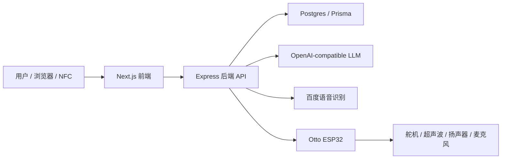

# Otto Actions Test

这是一个面向 Otto 机器人的完整交互项目，包含 ESP32 固件、网页控制台、后端 API、数据库、LLM 对话、语音链路和 NFC 抽签触发能力。

项目当前分为两部分：

- `Arduino/otto_actions_test/`：烧录到 ESP32 的 Otto 固件，负责舵机动作、超声波测距、I2S 音频播放、麦克风录音和局域网 HTTP 设备接口。
- `otto_web/`：Web 控制系统，前端使用 Next.js + Tailwind，后端使用 Express + Prisma + Postgres。

## 功能概览

- 网页端登录和机器人控制台
- Otto 动作执行、移动、说话和校准
- Action Lab 动作序列管理与执行
- Oracle 抽签与 LLM 流式解读
- Chat 对话、tool calling 和长期记忆
- 语音监听、百度语音识别 STT 和自动回复
- NFC 签文页面，可触发对应机器人剧场动作
- Mock 机器人模式，便于没有实体设备时开发网页和后端
- ESP32 HTTP 模式，用后端控制真实 Otto 机器人

## 目录结构

```text
.
├── Arduino/
│   └── otto_actions_test/
│       ├── otto_actions_test.ino   # ESP32 固件主入口
│       ├── ottoactions.h           # Otto 动作库和舵机控制
│       ├── Oscillator.h
│       └── Oscillator.cpp
├── otto_web/
│   ├── backend/                     # Express + Prisma API
│   ├── frontend/                    # Next.js 前端
│   ├── UI/                          # 页面参考稿和设计资料
│   ├── docker-compose.yml           # 本地开发：Postgres + API
│   ├── docker-compose.prod.yml      # 生产部署：Postgres + API
│   └── README.md                    # Web 子项目说明
└── PROJECT_GUIDE.md                 # 项目架构详细说明
```

## 系统架构

前端不直接连接 Otto，所有业务操作统一经过后端：



通信方式：

- 前端 -> 后端：HTTP / SSE
- 后端 -> ESP32：局域网 HTTP
- ESP32 -> 后端：HTTP 上传语音音频

## 环境要求

- Node.js 18+
- npm
- Docker 和 Docker Compose
- Arduino IDE 或兼容 ESP32 Arduino 的构建工具
- ESP32 Arduino 开发板支持包
- Arduino 库：
  - `ArduinoJson`
  - `ESP32Servo`

如果只开发 Web，可以先不连接实体 Otto，使用默认的 `ROBOT_MODE=mock`。

## 本地启动 Web 系统

### 1. 启动后端和数据库

```bash
cd otto_web
cp backend/.env.example backend/.env
docker compose up --build
```

后端 API 默认运行在：

```text
http://localhost:4000
```

开发 compose 会自动执行：

- `npm install`
- `prisma generate`
- `prisma db push`
- `npm run prisma:seed`
- `npm run dev`

### 2. 启动前端

另开一个终端：

```bash
cd otto_web/frontend
cp .env.example .env.local
npm install
npm run dev
```

前端默认运行在：

```text
http://localhost:3000
```

根路径会跳转到 `/control-center`。

### 3. 默认管理员账号

默认账号由 `otto_web/backend/.env` 控制：

```env
ADMIN_EMAIL=admin@otto.local
ADMIN_PASSWORD=otto-admin
ADMIN_NAME="Otto Administrator"
```

后端启动时会通过 seed 脚本创建或更新这个管理员账号。

## 关键环境变量

后端配置文件：

```text
otto_web/backend/.env
```

常用变量：

| 变量 | 说明 |
| --- | --- |
| `PORT` | 后端端口，默认 `4000` |
| `DATABASE_URL` | Postgres 连接地址 |
| `FRONTEND_ORIGIN` | 允许跨域访问的前端地址，多个地址用逗号分隔 |
| `JWT_SECRET` | 登录会话 JWT 密钥 |
| `COOKIE_SECRET` | Cookie 签名密钥 |
| `ADMIN_EMAIL` | 默认管理员邮箱 |
| `ADMIN_PASSWORD` | 默认管理员密码 |
| `LLM_BASE_URL` | OpenAI-compatible LLM 地址 |
| `LLM_API_KEY` | LLM API Key |
| `LLM_MODEL` | LLM 模型名 |
| `BAIDU_SPEECH_APP_ID` | 百度语音应用 ID |
| `BAIDU_SPEECH_API_KEY` | 百度语音 API Key |
| `BAIDU_SPEECH_SECRET_KEY` | 百度语音 Secret Key |
| `ROBOT_MODE` | `mock` 或 `esp32_http` |
| `OTTO_DEVICE_BASE_URL` | ESP32 设备地址，例如 `http://192.168.1.50` |
| `OTTO_DEVICE_TOKEN` | 后端访问 ESP32 时携带的设备 token |
| `BACKEND_DEVICE_BASE_URL` | ESP32 上传语音时访问的后端公网或局域网地址 |

前端配置文件：

```text
otto_web/frontend/.env.local
```

```env
NEXT_PUBLIC_API_URL=http://localhost:4000
```

## 连接真实 Otto

默认后端使用 Mock 设备：

```env
ROBOT_MODE=mock
```

要控制真实 ESP32 Otto，需要在 `otto_web/backend/.env` 中改为：

```env
ROBOT_MODE=esp32_http
OTTO_DEVICE_BASE_URL=http://<ESP32_IP>
OTTO_DEVICE_TOKEN=<和固件一致的设备 token>
OTTO_DEVICE_TIMEOUT_MS=5000
BACKEND_DEVICE_BASE_URL=http://<后端在局域网中的地址>:4000
```

注意：

- `OTTO_DEVICE_BASE_URL` 是后端请求 ESP32 的地址。
- `BACKEND_DEVICE_BASE_URL` 是 ESP32 上传语音音频时访问后端的地址，不能使用 ESP32 无法访问的 `localhost`。
- 固件中的 Wi-Fi、百度 TTS 和设备 token 当前写在 `Arduino/otto_actions_test/otto_actions_test.ino` 中，实际部署前建议改为本地配置或烧录前手动替换，不要提交真实密钥。

## ESP32 固件

固件目录：

```text
Arduino/otto_actions_test/
```

主入口：

```text
Arduino/otto_actions_test/otto_actions_test.ino
```

硬件引脚概览：

| 模块 | 引脚 |
| --- | --- |
| 左胯舵机 | GPIO13 |
| 右胯舵机 | GPIO12 |
| 左脚舵机 | GPIO14 |
| 右脚舵机 | GPIO27 |
| 左臂舵机 | GPIO26 |
| 右臂舵机 | GPIO25 |
| 超声波 TRIG | GPIO32 |
| 超声波 ECHO | GPIO33 |
| I2S 扬声器 LRC | GPIO22 |
| I2S 扬声器 DIN | GPIO15 |
| I2S 扬声器 BCLK | GPIO2 |
| I2S 麦克风 WS | GPIO21 |
| I2S 麦克风 SD | GPIO35 |
| I2S 麦克风 SCK | GPIO19 |

ESP32 对外 HTTP 接口包括：

- `GET /health`
- `GET /status`
- `POST /commands/action`
- `POST /commands/move`
- `POST /commands/speak`
- `POST /commands/calibrate`
- `POST /commands/sequence`
- `POST /commands/theater`
- `POST /commands/listen/start`
- `POST /commands/listen/stop`

设备接口鉴权 Header：

```text
X-Otto-Token: <device-token>
```

## Web 页面

- `/login`：登录页
- `/control-center`：机器人状态、遥控、对话和语音控制
- `/action-lab`：动作库和动作序列编辑
- `/oracle`：LLM 抽签解读
- `/fortune?tag=1`：NFC 抽签公开页面
- `/settings`：系统配置展示页

## 后端 API 概览

公开接口：

- `GET /api/health`
- `GET /api/public/nfc/draw?tag=1`
- `GET /api/public/nfc/catalog`
- `POST /api/voice/uploads?sessionId=...`，供 ESP32 上传音频

登录接口：

- `POST /api/auth/login`
- `POST /api/auth/logout`
- `GET /api/auth/me`

需要登录的接口：

- `GET /api/config`
- `GET /api/robot/status`
- `GET /api/robot/actions`
- `POST /api/robot/actions/:actionKey/execute`
- `POST /api/robot/move`
- `POST /api/robot/speak`
- `POST /api/robot/calibrate`
- `GET /api/action-lab/sequences`
- `GET /api/action-lab/sequences/:id`
- `POST /api/action-lab/sequences`
- `PUT /api/action-lab/sequences/:id`
- `POST /api/action-lab/sequences/:id/execute`
- `POST /api/oracle/draw`
- `GET /api/oracle/history`
- `GET /api/oracle/stream/:readingId`
- `POST /api/chat/messages`
- `GET /api/chat/conversations`
- `GET /api/chat/conversations/:id/messages`
- `GET /api/chat/stream/:conversationId`
- `GET /api/memory`
- `PATCH /api/memory/:id`
- `POST /api/memory/:id/archive`
- `POST /api/memory/extract`
- `POST /api/voice/listen/start`
- `POST /api/voice/listen/stop`
- `GET /api/voice/status`

## 常用脚本

后端：

```bash
cd otto_web/backend
npm run dev
npm run build
npm run start
npm run prisma:generate
npm run prisma:migrate
npm run prisma:seed
```

前端：

```bash
cd otto_web/frontend
npm run dev
npm run build
npm run start
npm run lint
```

## 生产后端部署

```bash
cd otto_web
cp backend/.env.production.example backend/.env.production
docker compose -f docker-compose.prod.yml up -d --build
```

生产 compose 只暴露 API 的 `4000` 端口，Postgres 保持在 Docker 内部网络。

如果服务器无法稳定拉取公共基础镜像，可以先在本地构建并导出后端镜像，再在服务器上使用 `docker-compose.server.yml` 加载预构建镜像。

## 开发注意事项

- 本地 Web 开发建议先用 `ROBOT_MODE=mock`，确认页面和 API 正常后再接入实体 Otto。
- LLM 变量未配置时，对话和 Oracle 流式生成会返回配置错误，但机器人控制、登录和基础页面仍可使用。
- 百度语音变量未配置时，真实语音识别不可用；Mock 模式下停止监听会使用内置测试文本。
- ESP32 需要和后端处在可互相访问的网络中，尤其是语音上传链路。
- 不要把真实 Wi-Fi 密码、百度密钥、LLM Key 或设备 token 提交到仓库。
